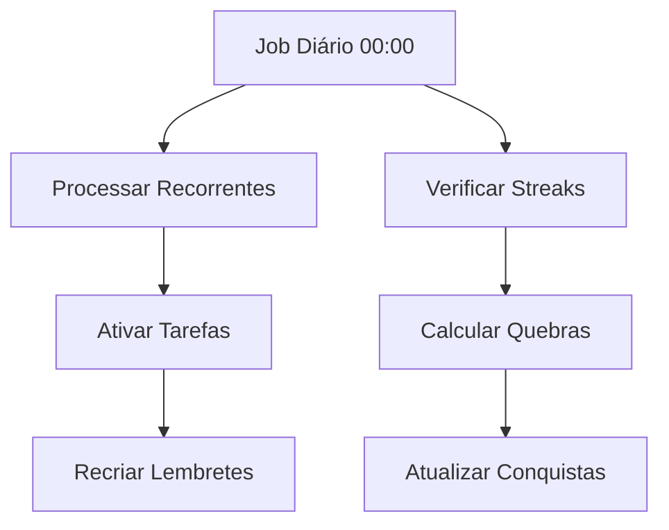

# Deep Dive: Tarefas Recorrentes e Hábitos

Este documento detalha a lógica de negócio para o gerenciamento de tarefas que se repetem e o rastreamento de hábitos e suas sequências (streaks).

## 1. Gerenciamento de Tarefas Recorrentes

Esta seção explica como uma tarefa é configurada para se repetir e como o sistema gerencia seu ciclo de vida.

### 1.1. Definição de Recorrência
| Camada   | Arquivo/Modelo                           | Elemento Principal                    | Descrição da Responsabilidade                                      |
| :------- | :--------------------------------------- | :------------------------------------ | :----------------------------------------------------------------- |
| Banco    | `prisma/schema.prisma`                   | `TaskRecurrence` (Modelo)             | Armazena `frequency` (daily/weekly/custom), `daysOfWeek[]` (0-6), `lastCompleted` (timestamp da última conclusão), `nextDue` (próxima data calculada) |
| Serviço  | `backend/src/services/taskService.ts`    | `createTask()` / `updateTask()`       | Cria/atualiza registros em `TaskRecurrence` através de upsert quando `isRecurring = true`, gerencia relacionamento 1:1 com Task |
| Serviço  | `backend/src/services/recurringTaskService.ts` | `processRecurringTasks()`       | Job diário (00:00) que busca tarefas com `isRecurring = true` e ativa instâncias baseadas na frequência configurada |
| UI       | `src/components/shared/NewTaskModal.tsx` | Formulário de configuração             | Interface para definir `frequency`, `daysOfWeek[]`, e toggle `isRecurring`, com validação de pelo menos um dia selecionado |

### 1.2. Lógica de Geração da Próxima Ocorrência
* **Gatilho:** Execução do job diário `processRecurringTasks()` às 00:00 e/ou conclusão de tarefa recorrente via `handleRecurringTaskCompletion()`
* **Serviço Responsável:** `backend/src/services/recurringTaskService.ts`
* **Função Principal:** `shouldActivateTaskToday()` + `activateTaskForToday()` + `calculateNextDue()`
* **Lógica Aplicada:**
  1. **Verificação de Ativação:** `shouldActivateTaskToday()` compara `frequency` com dia atual (0=domingo):
     - `daily`: sempre retorna `true`
     - `weekly`/`custom`: verifica se `currentDayOfWeek` está em `daysOfWeek[]`
  2. **Ativação de Instância:** `activateTaskForToday()` reseta tarefa para `status: 'pending'`, `plannedForToday: true`, `plannedDate: hoje`, limpa campos de adiamento
  3. **Cálculo de Próxima Data:** `calculateNextDue()` calcula:
     - `daily`: adiciona 1 dia
     - `weekly`/`custom`: encontra próximo dia válido em `daysOfWeek[]`, se não há nesta semana, vai para primeiro da próxima
  4. **Atualização de Recorrência:** Atualiza `TaskRecurrence.nextDue` e `lastCompleted` quando tarefa é concluída via `handleRecurringTaskCompletion()`

## 2. Gerenciamento de Hábitos e Streaks

Esta seção detalha o rastreamento de hábitos e o cálculo de sequências de conclusão.

### 2.1. Definição do Hábito
| Camada   | Arquivo/Modelo                       | Elemento Principal           | Descrição da Responsabilidade                                      |
| :------- | :----------------------------------- | :--------------------------- | :----------------------------------------------------------------- |
| Banco    | `prisma/schema.prisma`               | `Habit`, `HabitFrequency`    | `Habit` armazena nome, `streak`, `bestStreak`, `targetCount`. `HabitFrequency` define `type` (daily/weekly/custom), `intervalDays`, `daysOfWeek[]` |
| Banco    | `prisma/schema.prisma`               | `HabitCompletion`, `HabitStreak` | `HabitCompletion` registra conclusões diárias com chave única `(habitId, date)`. `HabitStreak` mantém streak global do usuário |
| Serviço  | `backend/src/services/habitService.ts` | `createHabit()`              | Cria hábito com frequência padrão (daily, targetCount=1) e configuração de `HabitFrequency` relacionada via cascade |

### 2.2. Rastreamento de Conclusão Diária
* **Ação do Usuário:** Clicar no botão "completar hábito" na interface de hábitos
* **Endpoint da API:** `POST /api/habits/{habitId}/complete` processado por `habitsController.completeHabit()`
* **Serviço Responsável:** `backend/src/services/habitService.ts`
* **Lógica de Persistência:**
  1. **Validação:** Verifica se hábito existe e `isActive = true` para o usuário
  2. **Processamento de Data:** Converte data fornecida (YYYY-MM-DD) ou usa hoje, normaliza para `00:00:00.000`
  3. **Upsert de Conclusão:** Usa chave única `(habitId, date)` para evitar duplicatas:
     - Se existe: incrementa `count` com novo valor
     - Se não existe: cria novo `HabitCompletion` com `count` inicial
  4. **Atualização de Streak Individual:** Apenas para novas conclusões de hoje, incrementa `habit.streak` e atualiza `bestStreak` se necessário

### 2.3. Lógica de Cálculo de Streak (Sequência)

O sistema possui dois tipos de streaks: individual por hábito e streak global do usuário.

#### 2.3.1. Streak Individual por Hábito
| Cenário do Usuário                            | Serviço Responsável                        | Lógica Aplicada ao Streak                                               |
| :-------------------------------------------- | :----------------------------------------- | :---------------------------------------------------------------------- |
| **Completa o hábito pela primeira vez hoje** | `habitService.completeHabit()` linha 188-196 | `habit.streak` é incrementado em 1, `bestStreak` atualizado se `newStreak > bestStreak` |
| **Completa o hábito novamente no mesmo dia** | `habitService.completeHabit()` linha 155-168 | Apenas incrementa `count` da conclusão existente, streak não é modificado (idempotente) |
| **Completa após pular dias** | Lógica implícita - não implementada | ⚠️ **Gap de implementação**: Sistema não detecta quebra de sequência individual, apenas incrementa sempre |

#### 2.3.2. Streak Global do Usuário (HabitStreak)
| Cenário do Usuário                            | Serviço Responsável                        | Lógica Aplicada ao Streak                                               |
| :-------------------------------------------- | :----------------------------------------- | :---------------------------------------------------------------------- |
| **Completa TODOS os hábitos do dia** | `habitStreakService.updateHabitStreak()` linha 120-142 | `currentStreak` incrementado se completou ontem também, senão resetado para 1. `bestStreak` atualizado se necessário |
| **Completa apenas alguns hábitos** | `habitStreakService.updateHabitStreak()` linha 174-189 | Streak não é incrementado. Se `lastCompleted < yesterday`, `currentStreak` é resetado para 0 |
| **Não tem hábitos programados para hoje** | `habitStreakService.updateHabitStreak()` linha 88-92 | Streak é mantido inalterado, não há penalidade por dias sem hábitos configurados |

#### 2.3.3. Algoritmo de Cálculo de Streak Global
```javascript
// Lógica em updateHabitStreak()
1. Buscar todos os hábitos ativos do usuário
2. Filtrar hábitos que são "para hoje" baseado na frequência:
   - daily: sempre incluído
   - weekly/custom: incluído se today.getDay() está em daysOfWeek[]
3. Verificar se TODOS os hábitos "para hoje" têm HabitCompletion na data atual
4. Se SIM:
   - Se completou ontem também: currentStreak++
   - Se não completou ontem: currentStreak = 1
   - bestStreak = max(bestStreak, currentStreak)
   - lastCompleted = hoje
5. Se NÃO:
   - Se lastCompleted < anteontem: currentStreak = 0
```

## 3. Job Diário e Processamento Automático

### 3.1. Job de Tarefas Recorrentes
| Componente | Arquivo | Função | Frequência | Responsabilidade |
| :--------- | :------ | :------ | :--------- | :--------------- |
| **Processador Principal** | `recurringTaskService.ts` | `processRecurringTasks()` | Diário 00:00 | Ativa tarefas recorrentes para o dia atual baseado na configuração de frequência |
| **Verificador de Ativação** | `recurringTaskService.ts` | `shouldActivateTaskToday()` | Por tarefa | Determina se tarefa deve ser ativada hoje comparando `daysOfWeek[]` com `today.getDay()` |
| **Ativador de Instância** | `recurringTaskService.ts` | `activateTaskForToday()` | Por tarefa ativa | Reseta status da tarefa e configura para aparecer no planejamento diário |

### 3.2. Detecção de Quebra de Streak de Hábitos
| Componente | Arquivo | Função | Quando Executa | Responsabilidade |
| :--------- | :------ | :------ | :------------- | :--------------- |
| **Reset Automático** | `habitStreakService.ts` | `resetStreakIfNeeded()` | Sob demanda | Verifica se `lastCompleted < yesterday` e reseta `currentStreak` para 0 |
| **Verificação Contínua** | `habitStreakService.ts` | `updateHabitStreak()` linha 180-187 | A cada conclusão | Integra lógica de reset dentro do fluxo principal de atualização |

## 4. Interações com Outros Sistemas

### 4.1. Integração com Gamificação
* **Tarefas Recorrentes:**
  - Cada conclusão de instância recorrente gera conquista `task_completion` baseada em `energyPoints` (bronze/prata/ouro)
  - Conclusões contribuem para `daily_master` e `weekly_legend` normalmente via `completeTask()` → `AchievementService.processTaskCompletion()`
  - Instâncias recorrentes são tratadas como tarefas independentes para fins de gamificação

* **Hábitos:**
  - `habitService.completeHabit()` chama `AchievementService.processHabitCompletion()` que atualmente não gera conquistas específicas
  - Contribui indiretamente para `daily_master` através de atualização do `DailyProgress.allHabitsCompleted`
  - **Gap de implementação**: Sistema não possui conquistas específicas para streaks de hábitos (ex: "7 dias consecutivos")

### 4.2. Integração com Lembretes
* **Tarefas Recorrentes:**
  - Quando tarefa recorrente é criada/atualizada, `taskService.ts` linha 440-468 gerencia `TaskRecurrence` via upsert
  - **Gap de integração**: Sistema de lembretes não recria automaticamente lembretes para novas instâncias de tarefas recorrentes
  - Lembretes existentes permanecem vinculados à instância original, não seguem o ciclo de recorrência

* **Hábitos:**
  - Hábitos podem ter lembretes configurados via `reminderService.createRecurringReminders()` 
  - Lembretes de hábitos seguem padrão `recurring` com `daysOfWeek[]` correspondente à frequência do hábito
  - Integração funcional: lembretes disparam independentemente das conclusões, mantendo consistência

## 5. Casos Extremos e Comportamentos Especiais

### 5.1. Tarefas Recorrentes
- **Conclusão Múltipla no Mesmo Dia:** Sistema permite completar e reativar tarefa recorrente múltiplas vezes no mesmo dia
- **Alteração de Frequência:** Mudanças na `TaskRecurrence` afetam apenas próximas ativações, instâncias já ativadas mantêm estado
- **Deleção Soft:** Tarefas com `isDeleted = true` são excluídas do processamento recorrente automaticamente

### 5.2. Hábitos e Streaks
- **Conclusões Retroativas:** Permitidas via parâmetro `date`, mas só atualizam streak se for hoje
- **Hábitos Sem Frequência:** Tratados como `daily` por padrão no cálculo de streak global
- **Múltiplas Conclusões por Dia:** Campo `count` permite rastrear quantidade, mas streak considera apenas presença
- **Mudança de Fuso Horário:** Datas são normalizadas para `00:00:00.000` local, pode causar inconsistências

### 5.3. Performance e Otimizações
- **Índices:** Chave única `(habitId, date)` em `HabitCompletion` previne duplicatas e otimiza queries
- **Batch Processing:** Job de recorrência processa todas as tarefas em uma única transação
- **Lazy Loading:** Frequências de hábito são carregadas apenas quando necessário via `include`
- **Caching:** Frontend usa React Query para cachear completions de hábitos por 5 minutos

## 6. Limitações e Melhorias Futuras

### 6.1. Limitações Atuais
1. **Streak Individual:** Hábitos individuais não detectam quebra de sequência, apenas incrementam
2. **Timezone Handling:** Processamento baseado em servidor pode não considerar fuso do usuário
3. **Lembrete-Recorrência:** Lembretes não acompanham ciclo de tarefas recorrentes automaticamente
4. **Conquistas de Hábito:** Ausência de gamificação específica para streaks longos

### 6.2. Arquitetura de Melhorias


### 6.3. Considerações de Escalabilidade
- **Volume de Dados:** `HabitCompletion` cresce linearmente com usuários × dias × hábitos
- **Query Performance:** Queries de streak podem ser otimizadas com índices compostos em `(userId, date)`
- **Job Processing:** Processamento de recorrência pode ser distribuído por batches de usuários
- **Real-time Updates:** Frontend poderia usar WebSockets para atualização instantânea de streaks