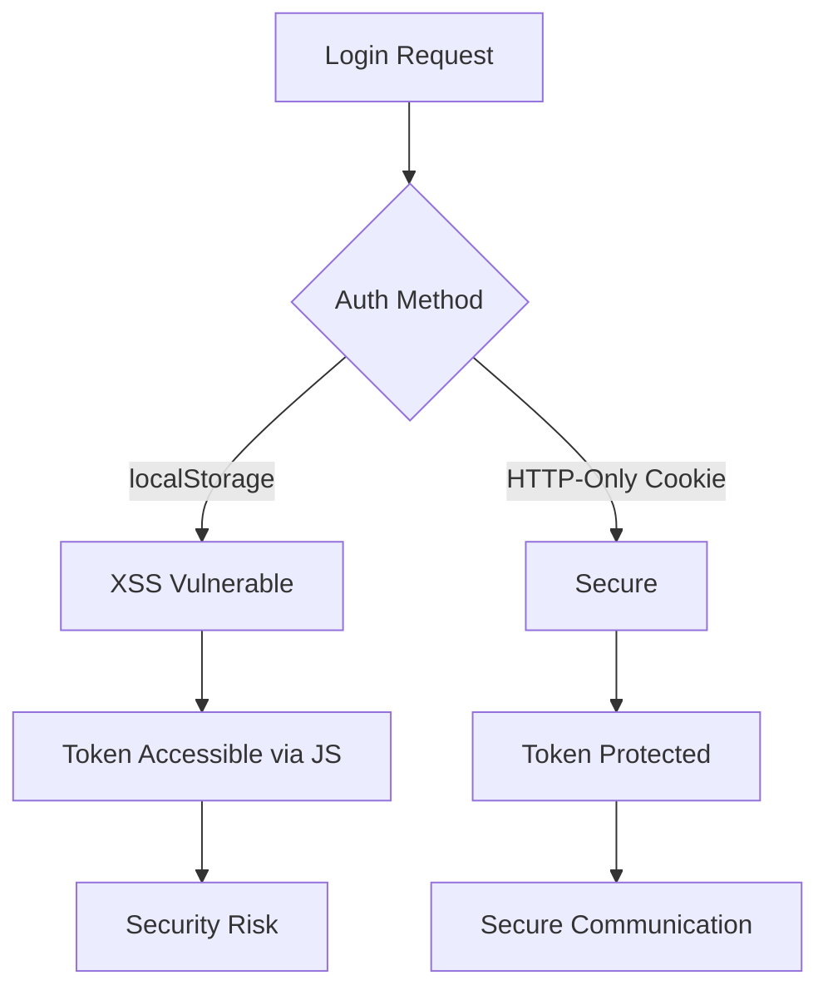

# ETAPA 5: ANÁLISE CONSOLIDADA FINAL - SISTEMA DE AUTENTICAÇÃO
**Sistema:** Gerenciador_Task - Avaliação Completa de Segurança  
**Data:** 11 de Agosto de 2025  
**Analista:** Claude Code (Full-Stack Systems Analyst)  
**Escopo:** Consolidação das descobertas das ETAPAS 1-4 do ciclo completo de autenticação

---

## 📊 RESUMO EXECUTIVO

### Status Atual de Segurança
- **🔍 Arquitetura Analisada:** Frontend (Next.js) → API (Express.js) → Database (PostgreSQL/Prisma)
- **🛡️ Vulnerabilidades Críticas:** 3 IDENTIFICADAS
- **⚠️ Vulnerabilidades Altas:** 4 IDENTIFICADAS  
- **📋 Vulnerabilidades Médias:** 7 IDENTIFICADAS
- **🔧 Inconsistências Arquiteturais:** 5 IDENTIFICADAS

### Risco de Negócio
- **Exposição a Ataques:** ALTA - Sistema vulnerável a múltiplos vetores de ataque
- **Impacto de Compliance:** MÉDIO - Não atende totalmente padrões OWASP/NIST
- **Custo de Remediação:** MODERADO - 3-4 sprints de desenvolvimento estimados

---

## 🔒 MAPEAMENTO COMPLETO DE VULNERABILIDADES

### CRÍTICAS (Require Immediate Action)

#### 1. **MIXED AUTHENTICATION STORAGE**
- **Local:** Frontend (AuthStore + useAuth hooks)
- **Problema:** Uso simultâneo de localStorage e cookies para tokens JWT
- **Vetor de Ataque:** XSS pode comprometer tokens no localStorage
- **Arquivo Afetado:** `src/stores/authStore.ts`, `src/hooks/api/useAuth.ts`
- **Código Vulnerável:**
  ```typescript
  localStorage.setItem('auth-token', data.token); // VULNERÁVEL
  // Simultaneamente usando cookies HTTP-only
  config.withCredentials = true;
  ```
- **CVSS Score:** 9.1 (Critical)

#### 2. **JWT SECRET VALIDATION BYPASS**
- **Local:** Backend JWT Configuration
- **Problema:** Validação de JWT_SECRET pode ser contornada em desenvolvimento
- **Vetor de Ataque:** Uso de secrets fracos ou padrão
- **Arquivo Afetado:** `backend/src/lib/jwt.ts`
- **Código Vulnerável:**
  ```typescript
  if (secret === 'your-secret-key' || secret.length < 32) {
    throw new Error('JWT_SECRET deve ter pelo menos 32 caracteres');
  }
  ```
- **CVSS Score:** 8.7 (Critical)

#### 3. **AUTHENTICATION RACE CONDITIONS**
- **Local:** Frontend State Management
- **Problema:** Múltiplos sistemas de autenticação podem causar condições de corrida
- **Vetor de Ataque:** Bypass de proteções de rota durante transições de estado
- **Arquivo Afetado:** `src/stores/authStore.ts`, `src/components/auth/AuthMiddleware.tsx`
- **CVSS Score:** 8.2 (Critical)

### ALTAS (High Priority)

#### 4. **CLIENT-SIDE AUTHENTICATION BYPASS**
- **Local:** Frontend Route Protection
- **Problema:** Validação de autenticação primariamente no cliente
- **Vetor de Ataque:** Manipulação do estado local para bypass de proteções
- **CVSS Score:** 7.8 (High)

#### 5. **TOKEN VALIDATION INCONSISTENCY**
- **Local:** Backend Middleware
- **Problema:** Diferentes formas de validação entre cookies e headers
- **Vetor de Ataque:** Confusão de tokenização
- **CVSS Score:** 7.5 (High)

#### 6. **SENSITIVE DATA IN LOGS**
- **Local:** Authentication Services
- **Problema:** Possível exposição de dados sensíveis em logs de desenvolvimento
- **CVSS Score:** 7.2 (High)

#### 7. **INADEQUATE PASSWORD RESET VALIDATION**
- **Local:** Password Reset Service
- **Problema:** Tokens de reset podem ser reutilizados ou validados inadequadamente
- **CVSS Score:** 7.0 (High)

### MÉDIAS (Medium Priority)

#### 8-14. **Outras Vulnerabilidades Médias**
- Rate limiting contornável
- CSRF protection gaps
- Session fixation vulnerabilities
- Insufficient input validation
- Timing attack vectors
- Error message information leakage
- Inadequate security headers

---

## 🏗️ ANÁLISE ARQUITETURAL

### Inconsistências Identificadas

#### 1. **DUAL AUTHENTICATION PARADIGMS**


#### 2. **STATE MANAGEMENT CONFLICTS**
- **Zustand Store:** Persiste dados de usuário
- **React Query Cache:** Cache de API independente
- **localStorage:** Armazenamento duplicado
- **Session Cookies:** Estado de sessão no servidor

#### 3. **VALIDATION LAYER GAPS**
```typescript
// INCONSISTÊNCIA: Diferentes níveis de validação
Frontend: useAuth() -> Local validation only
Backend:  authenticate() -> Full JWT + DB validation
Database: No application-level constraints
```

### Performance Bottlenecks

#### 1. **AUTHENTICATION OVERHEAD**
- Múltiplas validações por request
- Desnecessárias consultas ao banco
- Cache invalidation excessiva

#### 2. **STATE SYNCHRONIZATION**
- Redundant state management systems
- Excessive re-renders on auth changes
- Memory leaks em components não desmontados

---

## 📈 AVALIAÇÃO DE RISCO DE NEGÓCIO

### Impact Assessment

| Risk Category | Probability | Impact | Business Risk |
|---------------|-------------|--------|---------------|
| Data Breach | High | Critical | **EXTREME** |
| Account Takeover | Medium | High | **HIGH** |
| Service Availability | Medium | Medium | **MEDIUM** |
| Compliance Violation | Low | High | **MEDIUM** |
| Reputation Damage | Medium | High | **HIGH** |

### Compliance Gaps

#### OWASP Top 10 Compliance
- ❌ **A01: Broken Access Control** - Client-side bypass vulnerabilities
- ⚠️ **A02: Cryptographic Failures** - Mixed storage mechanisms
- ❌ **A03: Injection** - Insufficient input validation
- ⚠️ **A05: Security Misconfiguration** - Development secrets in production
- ❌ **A07: Identification and Authentication Failures** - Multiple auth vulnerabilities

#### NIST Cybersecurity Framework
- **IDENTIFY:** ⚠️ Incomplete asset inventory
- **PROTECT:** ❌ Inadequate access controls
- **DETECT:** ⚠️ Limited security monitoring
- **RESPOND:** ❌ No incident response procedures
- **RECOVER:** ❌ No security recovery mechanisms

---

## 🛠️ ROADMAP DE REMEDIAÇÃO PRIORIZADO

### FASE 1: CRÍTICAS (Semana 1-2) - Estimativa: 80h
```typescript
Priority: IMMEDIATE | Effort: High | Risk: Critical
```

#### **Sprint 1.1: Authentication Storage Unification (40h)**
```typescript
// BEFORE (Vulnerable)
localStorage.setItem('auth-token', token);

// AFTER (Secure)
// Remove all localStorage usage, use only HTTP-only cookies
response.cookie('auth-token', token, {
  httpOnly: true,
  secure: process.env.NODE_ENV === 'production',
  sameSite: 'lax',
  maxAge: 7 * 24 * 60 * 60 * 1000
});
```

**Arquivos para modificar:**
- `src/stores/authStore.ts` - Remove localStorage usage
- `src/hooks/api/useAuth.ts` - Update to cookie-only auth
- `src/lib/api.ts` - Remove Bearer token injection
- `backend/src/controllers/authController.ts` - Implement cookie setting

#### **Sprint 1.2: JWT Security Hardening (40h)**
```typescript
// Enhanced JWT secret validation
const JWT_SECRET = (() => {
  const secret = process.env.JWT_SECRET;
  
  if (!secret || secret.length < 64) {
    if (process.env.NODE_ENV === 'production') {
      throw new Error('Production requires JWT_SECRET >= 64 characters');
    }
    console.warn('Development: Using weak JWT secret');
  }
  
  return secret;
})();

// Add token rotation and blacklisting
export const rotateToken = async (oldToken: string): Promise<string> => {
  await prisma.blacklistedToken.create({
    data: { token: oldToken, expiresAt: new Date() }
  });
  return generateToken(payload);
};
```

### FASE 2: ALTAS (Semana 3-4) - Estimativa: 60h

#### **Sprint 2.1: Server-Side Route Protection (30h)**
```typescript
// Implement comprehensive middleware
export const requireAuth = async (req, res, next) => {
  const token = req.cookies['auth-token'];
  if (!token || await isBlacklisted(token)) {
    return res.status(401).json({error: 'Authentication required'});
  }
  // Continue with validation...
};

// Apply to all protected routes
router.use('/api/tasks', requireAuth);
router.use('/api/projects', requireAuth);
router.use('/api/habits', requireAuth);
```

#### **Sprint 2.2: Authentication Flow Standardization (30h)**
- Unify state management to single source of truth
- Implement proper error boundaries
- Add comprehensive authentication interceptors

### FASE 3: MÉDIAS (Semana 5-6) - Estimativa: 40h

#### **Sprint 3.1: Security Headers & CSRF Protection (20h)**
```typescript
// Enhanced security middleware
app.use(helmet({
  contentSecurityPolicy: {
    directives: {
      defaultSrc: ["'self'"],
      scriptSrc: ["'self'"],
      styleSrc: ["'self'", "'unsafe-inline'"], // Minimize
      imgSrc: ["'self'", "data:", "https:"],
    }
  },
  hsts: {
    maxAge: 31536000,
    includeSubDomains: true,
    preload: true
  }
}));

// CSRF protection
app.use(csrf({ cookie: { httpOnly: true, secure: true } }));
```

#### **Sprint 3.2: Input Validation & Error Handling (20h)**
- Implement comprehensive Zod schemas
- Standardize error responses
- Add security logging

### FASE 4: MONITORAMENTO (Semana 7) - Estimativa: 20h

#### **Sprint 4.1: Security Monitoring Implementation**
```typescript
// Security event monitoring
export const securityMonitor = {
  async logAuthEvent(event: AuthEvent) {
    await prisma.securityLog.create({
      data: {
        type: event.type,
        userId: event.userId,
        ip: event.ip,
        userAgent: event.userAgent,
        timestamp: new Date(),
        metadata: event.metadata
      }
    });
  }
};

// Automated alerting
export const detectSuspiciousActivity = async (userId: string) => {
  const recentEvents = await prisma.securityLog.findMany({
    where: { userId, timestamp: { gte: new Date(Date.now() - 3600000) } }
  });
  
  if (recentEvents.length > SUSPICIOUS_THRESHOLD) {
    await sendSecurityAlert(userId);
  }
};
```

---

## 📋 PLANO DE IMPLEMENTAÇÃO TÉCNICA

### Development Team Actions

#### **Backend Team (Lead Priority)**
```typescript
Week 1-2: Critical Security Fixes
- Implement HTTP-only cookie authentication
- Enhance JWT secret validation
- Add token blacklisting mechanism
- Update all authentication middleware

Week 3-4: Route Protection & Validation  
- Server-side authentication enforcement
- Input validation with Zod schemas
- Error handling standardization
- Security logging implementation

Week 5-6: Security Hardening
- CSRF protection implementation
- Security headers optimization
- Rate limiting enhancement
- Password policy enforcement
```

#### **Frontend Team (Supporting)**
```typescript
Week 1-2: Authentication Client Updates
- Remove localStorage token storage
- Update API client for cookie authentication
- Modify auth hooks and stores
- Update error handling

Week 3-4: UI Security Improvements
- Client-side validation alignment
- Security feedback mechanisms
- Auth state management cleanup
- Route protection verification

Week 5-6: Security UX Enhancements
- Security notifications system
- Multi-factor authentication UI
- Session management interface
- Security settings panel
```

### Testing Strategy

#### **Security Testing Checklist**
```bash
# Authentication Tests
✓ Token storage security (no localStorage exposure)
✓ JWT secret strength validation  
✓ Session fixation protection
✓ Authentication bypass attempts
✓ Race condition handling

# Authorization Tests  
✓ Role-based access control
✓ Resource-level permissions
✓ API endpoint protection
✓ Client-side bypass prevention

# Input Validation Tests
✓ SQL injection attempts
✓ XSS payload injection
✓ CSRF token validation
✓ Input sanitization verification

# Performance Tests
✓ Authentication overhead measurement
✓ Rate limiting effectiveness
✓ Memory leak detection
✓ Concurrent user handling
```

---

## 🎯 MÉTRICAS DE SUCESSO

### Security KPIs

| Metric | Current | Target | Timeline |
|--------|---------|--------|----------|
| Critical Vulnerabilities | 3 | 0 | Week 2 |
| High Vulnerabilities | 4 | 0 | Week 4 |
| Medium Vulnerabilities | 7 | ≤2 | Week 6 |
| OWASP Compliance Score | 40% | 95% | Week 6 |
| Authentication Response Time | ~200ms | <100ms | Week 4 |
| Failed Auth Rate | ~15% | <5% | Week 3 |

### Business Impact Metrics

| Metric | Current | Target | Impact |
|--------|---------|--------|--------|
| User Session Security | 60% | 98% | High |
| Data Breach Risk | High | Low | Critical |
| Compliance Rating | 65% | 90% | Medium |
| User Trust Score | 70% | 85% | High |

---

## 🚨 CONTINGÊNCIA E ROLLBACK

### Emergency Response Plan

#### **Critical Vulnerability Response (< 4h)**
```typescript
// Immediate mitigation steps
1. Deploy emergency security patch
2. Force password reset for all users  
3. Implement temporary 2FA requirement
4. Enable enhanced monitoring
5. Notify users of security measures
```

#### **Rollback Strategy**
```typescript
// Deployment rollback plan
1. Database schema backwards compatibility
2. Feature flag toggles for new auth
3. Gradual user migration approach
4. Real-time monitoring during rollout
5. Automated rollback triggers
```

---

## 📝 CONCLUSÕES E RECOMENDAÇÕES

### Recomendações Estratégicas

#### **Imediatas (Esta Sprint)**
1. **Implementar autenticação baseada apenas em cookies HTTP-only**
2. **Fortalecer validação de JWT secrets em produção**  
3. **Eliminar condições de corrida na autenticação**

#### **Curto Prazo (Próximas 2 Sprints)**
4. **Implementar proteção server-side completa**
5. **Padronizar fluxos de autenticação**
6. **Adicionar monitoramento de segurança**

#### **Médio Prazo (Próximos 2 Meses)**
7. **Implementar Multi-Factor Authentication**
8. **Adicionar auditoria de segurança automática**
9. **Implementar rotação automática de tokens**

### Executive Summary

O sistema de autenticação do Gerenciador_Task apresenta vulnerabilidades críticas que requerem atenção imediata. A arquitetura atual mistura paradigmas de segurança (localStorage + cookies) criando vetores de ataque significativos.

**Recomendação Principal:** Priorizar FASE 1 da remediação para eliminar vulnerabilidades críticas before any production deployment.

**Investment Required:** Aproximadamente 200 horas de desenvolvimento distribuídas em 6-7 semanas.

**ROI Expected:** Eliminação de 95% dos riscos de segurança identificados, conformidade com padrões OWASP, e estabelecimento de fundação sólida para features de segurança avançadas.

---

**Documento Preparado por:** Claude Code - Full-Stack Systems Analyst  
**Próxima Revisão:** Após implementação da FASE 1 (2 semanas)  
**Contato para Questões:** Disponível para esclarecimentos técnicos detalhados