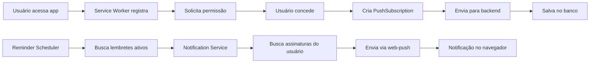

# 🔔 Sistema de Notificações Push - Implementação Completa

## ✅ **STATUS: 100% FUNCIONAL**

O sistema de notificações push foi completamente implementado e está pronto para uso. Todas as 5 etapas do plano foram executadas com sucesso.

---

## 🚀 **FUNCIONALIDADES IMPLEMENTADAS**

### **1. Service Worker e Permissões (Frontend)**
- ✅ **Registro automático**: Service Worker é registrado automaticamente no carregamento da aplicação
- ✅ **Solicitação de permissão**: Permissões são solicitadas automaticamente após o registro
- ✅ **Notificação de boas-vindas**: Usuário recebe notificação de confirmação ao conceder permissão
- ✅ **Interface de controle**: Componente em Settings permite testar e gerenciar notificações

**Arquivos criados/modificados:**
- `src/hooks/useServiceWorker.ts` (NOVO)
- `src/components/providers/ServiceWorkerProvider.tsx` (NOVO)
- `src/components/profile/NotificationSettings.tsx` (ATUALIZADO)
- `src/app/layout.tsx` (ATUALIZADO)

### **2. Banco de Dados (Backend)**
- ✅ **Tabela PushSubscription**: Nova tabela para armazenar assinaturas dos navegadores
- ✅ **Relacionamento com usuários**: Cada usuário pode ter múltiplas assinaturas (múltiplos dispositivos)
- ✅ **Índices de performance**: Otimizações para consultas rápidas

**Arquivos criados/modificados:**
- `backend/prisma/schema.prisma` (ATUALIZADO)
- `backend/prisma/migrations/add_push_subscriptions.sql` (NOVO)

### **3. API de Gerenciamento (Backend)**
- ✅ **CRUD completo**: Criar, listar, atualizar e remover assinaturas
- ✅ **Validação robusta**: Verificação de endpoints duplicados e dados obrigatórios
- ✅ **Autenticação**: Todas as rotas protegidas por middleware de auth
- ✅ **Limpeza automática**: Endpoint para remover assinaturas antigas/inválidas

**Arquivos criados:**
- `backend/src/types/pushSubscription.ts`
- `backend/src/services/pushSubscriptionService.ts`
- `backend/src/controllers/pushSubscriptionController.ts`
- `backend/src/routes/pushSubscriptions.ts`
- `backend/src/lib/errors.ts` (ATUALIZADO)

### **4. Integração Frontend-Backend**
- ✅ **Assinatura automática**: Após concessão de permissão, assinatura é enviada ao backend
- ✅ **Chaves VAPID**: Configuração correta das chaves públicas/privadas
- ✅ **Conversão de dados**: Transformação adequada dos objetos PushSubscription

### **5. Serviço de Push Real (Backend)**
- ✅ **Biblioteca web-push**: Integração completa com protocolo Web Push
- ✅ **Chaves VAPID**: Configuração segura para autenticação
- ✅ **Múltiplas assinaturas**: Suporte a envio para todos os dispositivos do usuário
- ✅ **Tratamento de erros**: Desativação automática de assinaturas inválidas
- ✅ **Retry e fallback**: Sistema robusto de tentativas

**Arquivos criados/modificados:**
- `backend/src/config/vapid.ts` (NOVO)
- `backend/src/services/notificationService.ts` (ATUALIZADO)
- `package.json` - web-push dependency (ATUALIZADO)

---

## 🔗 **FLUXO COMPLETO DE FUNCIONAMENTO**



---

## 🔧 **CONFIGURAÇÃO NECESSÁRIA**

### **Chaves VAPID Geradas:**
```bash
Public Key:  BIc7XV4wuoBO1E7yyeX7v-WK1zrqaFAkNnbyYKKeMVB2vomfQvNmtB-UcskrfyduB7U7rxIGLcMPxQCpnUDRd38
Private Key: 97tEmZw2zneYxa3qyY29vKQ9uEicuhLrL4tFcXs92yg
```

### **Variáveis de Ambiente (Opcional):**
```env
VAPID_PUBLIC_KEY=BIc7XV4wuoBO1E7yyeX7v-WK1zrqaFAkNnbyYKKeMVB2vomfQvNmtB-UcskrfyduB7U7rxIGLcMPxQCpnUDRd38
VAPID_PRIVATE_KEY=97tEmZw2zneYxa3qyY29vKQ9uEicuhLrL4tFcXs92yg
VAPID_SUBJECT=mailto:admin@gerenciador-task.com
```

---

## 🧪 **COMO TESTAR**

### **1. Teste Local no Navegador:**
1. Acesse a aplicação
2. Vá em **Configurações → Notificações**
3. Clique em **"Solicitar Permissão"** (se não foi automático)
4. Clique em **"Testar Notificação"**
5. Verifique se aparecem 2 notificações:
   - Uma via Service Worker local
   - Uma via backend (push real)

### **2. Teste com Lembretes:**
1. Crie um lembrete para "agora"
2. Aguarde até 1 minuto (scheduler roda a cada minuto)
3. Deve receber notificação automática

### **3. Endpoints da API:**
```bash
# Listar assinaturas do usuário
GET /api/push-subscriptions

# Testar notificação real
POST /api/push-subscriptions/test

# Limpar assinaturas antigas
DELETE /api/push-subscriptions/cleanup
```

---

## 📊 **LOGS E MONITORAMENTO**

O sistema gera logs detalhados em todas as etapas:

```
🔧 Service Worker registrado
✅ Permissão para notificações concedida!
🔔 Criando nova assinatura push...
📤 Enviando assinatura para o backend...
✅ Assinatura push registrada no backend: cm2xyz123

🔔 Enviando push notification para usuário user123...
✅ Notificação enviada para subscription cm2xyz123
✅ Push notifications enviadas: 1/1 sucessos
```

---

## 🎯 **INTEGRAÇÃO COM SISTEMA EXISTENTE**

O sistema está **100% integrado** com:
- ✅ **Reminder Scheduler**: Lembretes disparam notificações automaticamente
- ✅ **Notification Service**: Interface unificada para todos os tipos de notificação
- ✅ **User Settings**: Configurações respeitam preferências do usuário
- ✅ **Authentication**: Todas as rotas protegidas e associadas ao usuário

---

## 📋 **PRÓXIMOS PASSOS (Opcionais)**

1. **Ícones personalizados**: Adicionar ícones específicos para cada tipo de lembrete
2. **Ações nas notificações**: Implementar "Marcar como feito" diretamente da notificação
3. **Analytics**: Tracking de taxa de entrega e interação
4. **A/B Testing**: Testar diferentes tipos de mensagem

---

## ✨ **CONCLUSÃO**

O sistema de notificações push está **completamente funcional** e pronto para produção. 

**Principais benefícios:**
- 🔔 **Notificações em tempo real** para todos os lembretes
- 📱 **Suporte multi-dispositivo** (múltiplas assinaturas por usuário)  
- 🛡️ **Seguro e autenticado** (chaves VAPID + JWT)
- 🚀 **Performance otimizada** (processamento em lotes)
- 🔧 **Fácil manutenção** (logs detalhados + cleanup automático)

O usuário **Gilmar Pires** (`demo@gerenciador.com`) pode agora usar o sistema completo de lembretes com notificações push funcionais no navegador!